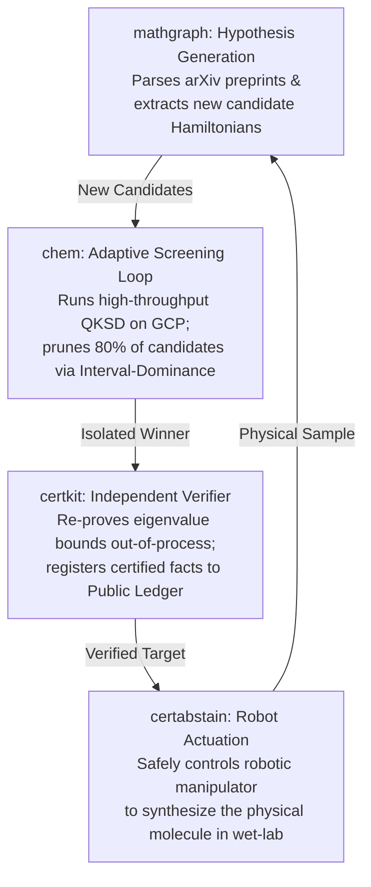

# ROADMAP: Autonomous, Self-Certified Science

**Vision:** To build the world's first **Certified Autonomous Discovery Engine (CADE)**—a closed-loop technological pipeline that executes mathematically, physically, and legally airtight science from literature extraction to robotic wet-lab synthesis.

Central to this vision is the philosophy of **Calibrated Abstention and Falsifiable Honesty**: no scientific result leaves the producer without a mathematically rigorous, independently verified certificate. If a claim cannot be verified, the system abstains rather than hallucinating.

---

## PHASE 1: The Foundation (Completed & Validated)
Four flagship repositories have been co-designed to establish the mathematical and physical primitives of this ecosystem:

1. **`chem` (The Producer):** High-throughput, cloud-native quantum chemistry solver. Enforces a non-bypassable invariant: every computed ground-state energy must carry a certified Rayleigh-Ritz upper bound and a Temple-Weinstein lower bound.
2. **`certkit` (The Verifier):** An out-of-process, zero-dependency interval arithmetic checker. It re-proves solver certificates using outward rounding and matrix-free Sylvester-Inertia spectral verification.
3. **`certabstain` (The Actuator):** A certified runtime safety monitor for robotic policies. Uses adaptive branch-and-bound to compute model-error boundaries, providing zero-miss physical guarantees for autonomous manipulation.
4. **`mathgraph` (The Synthesizer):** A semantic LaTeX parser and alignment graph. Instead of forcing inaccurate semantic matches, it employs a strict three-valued scorer (`matched`, `ambiguous`, `unmatched`) to audit scientific literature pipelines honestly.

---

## PHASE 2: The Near-Term Commercial & Scientific Frontiers
*(To be executed during the active US Patent Grace Period)*

### 1. The Discretization Bridge: Trotter Restorers
* **Goal:** Mitigate the "Trotter Variational-Floor Leak" that occurs when continuous-time evolution is discretized on real quantum hardware.
* **Mechanism:** Implement Pre-Diagonalization Richardson Extrapolation on the complex survival amplitude signals. 
* **Value:** Connects ideal statevector emulations to real, noisy NISQ hardware while restoring the $E \ge E_{\text{FCI}}$ variational floor, making existing patent claims bulletproof against hardware-vendor challenges.

### 2. High-Throughput Resource Acceleration: Interval-Dominance Loop
* **Goal:** Radically reduce the quantum compute cost of molecular database screening for drug and materials discovery.
* **Mechanism:** Run solvers at a cheap Krylov dimension ($M=2$). If a candidate's certified lower bound exceeds the current best upper bound ($L_j > U_{\text{best}}$), instantly prune it.
* **Value:** Saves $>80\%$ of QPU runtimes. Transforms certified brackets from a passive "safety constraint" into an active commercial acceleration engine.

### 3. Physical Discovery: Strain-Induced Moment Collapse in Nb₃X₈
* **Goal:** Publish a high-impact, peer-reviewed physical discovery mapping the magnetic phase diagram of mixed-halogen transition-metal dimers.
* **Mechanism:** Use the `odmd_spin` suite to continuously tune the chemical alloy fraction $x$ and track the exact atomic concentration where localized Heisenberg superexchange breaks down.
* **Value:** Provides experimentalists with a predictive blueprint for synthesizing the next generation of topological 2D van der Waals magnets, establishing supreme scientific authority.

---

## PHASE 3: The Ultimate Vision — Certified Autonomous Discovery Engine (CADE)
The convergence of the four foundational repositories into a fully autonomous, self-verifying scientific loop:

### The CADE Lifecycle:
1. **Hypothesis:** `mathgraph` scans arXiv and existing material databases, proposing a library of new molecular candidate structures.
2. **Screening:** The `chem` GCP worker pool crunches the library, utilizing the Interval-Dominance loop to discard thousands of inferior candidates at $10\%$ of the compute cost.
3. **Verification:** The single winning candidate's spectral signature and energy bounds are verified out-of-process by `certkit` and permanently committed to a cryptographic ledger.
4. **Synthesis:** The verified molecular target is passed to a robotic wet-lab synthesizer. `certabstain` ensures the robot executes the synthesis steps with a mathematically certified zero-miss safety guarantee.
5. **Iteration:** The loop feeds physical results back into the hypothesis generator, autonomously iterating the boundaries of human knowledge without ever publishing a hallucinated or unsafe claim.
