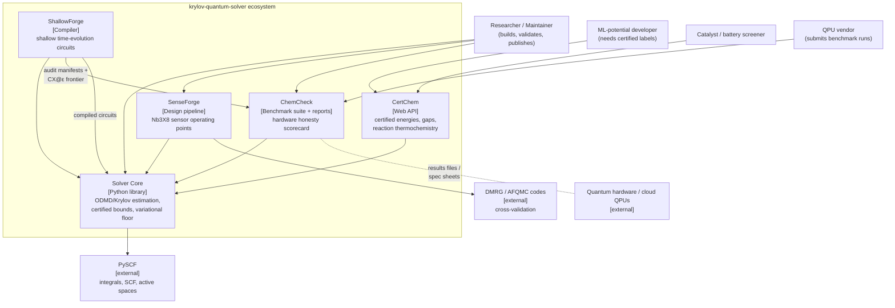

# C4 Level 1 — System Context

The ecosystem: one solver core, four products built on it. Arrows show who uses what
and which external systems each depends on.

Boundary notes
- Solver Core is the only component that touches quantum-chemistry math; everything
  else composes it (ADR-0005).
- ChemCheck never requires QPU access: Mode A scores from spec sheets alone.
- DMRG/AFQMC are validation dependencies of SenseForge only (ADR-0003 gates).
