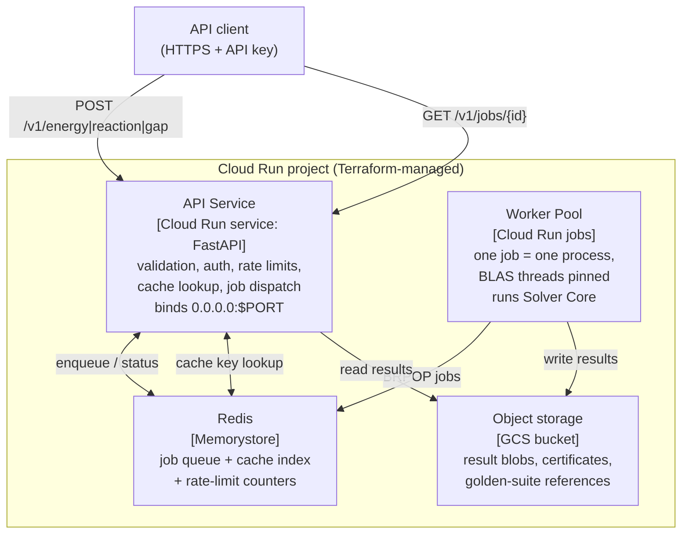

# C4 Level 2 — Containers: CertChem deployment

Container responsibilities
| Container | Owns | Explicitly does not own |
|---|---|---|
| API Service | HTTP contract, caps, auth, cache/queue orchestration | any chemistry |
| Worker Pool | executing `certified_energy()` et al. | HTTP, auth |
| Redis | queue, cache index, rate counters | result payloads (blobs go to GCS) |
| GCS | durable results + certificates | mutable state |

Sync path: cache hit or job estimated <30 s → response inline.
Async path: 202 + job_id → worker → GET /v1/jobs/{id} (ADR-0008).
