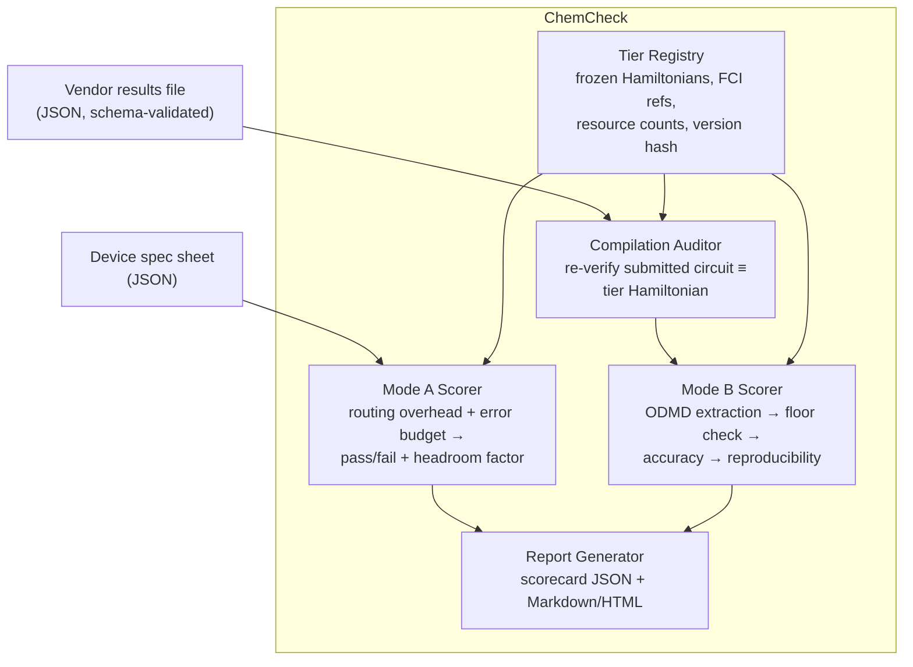

# C4 Level 3 — Components: ChemCheck scorer

```mermaid
flowchart TB
    specsheet["Device spec sheet<br/>(JSON)"]
    results["Vendor results file<br/>(JSON, schema-validated)"]

    subgraph cc["ChemCheck"]
        tiers["Tier Registry<br/>frozen Hamiltonians, FCI refs,<br/>resource counts, version hash"]
        modea["Mode A Scorer<br/>routing overhead + error budget →<br/>pass/fail + headroom factor"]
        audit["Compilation Auditor<br/>re-verify submitted circuit ≡<br/>tier Hamiltonian"]
        modeb["Mode B Scorer<br/>ODMD extraction → floor check →<br/>accuracy → reproducibility"]
        report["Report Generator<br/>scorecard JSON + Markdown/HTML"]
    end

    specsheet --> modea
    results --> audit --> modeb
    tiers --> modea
    tiers --> audit
    tiers --> modeb
    modea --> report
    modeb --> report
```

Scoring order in Mode B is fixed and short-circuiting:
audit fail → REJECTED; floor fail → UNPHYSICAL; then accuracy; then reproducibility.
