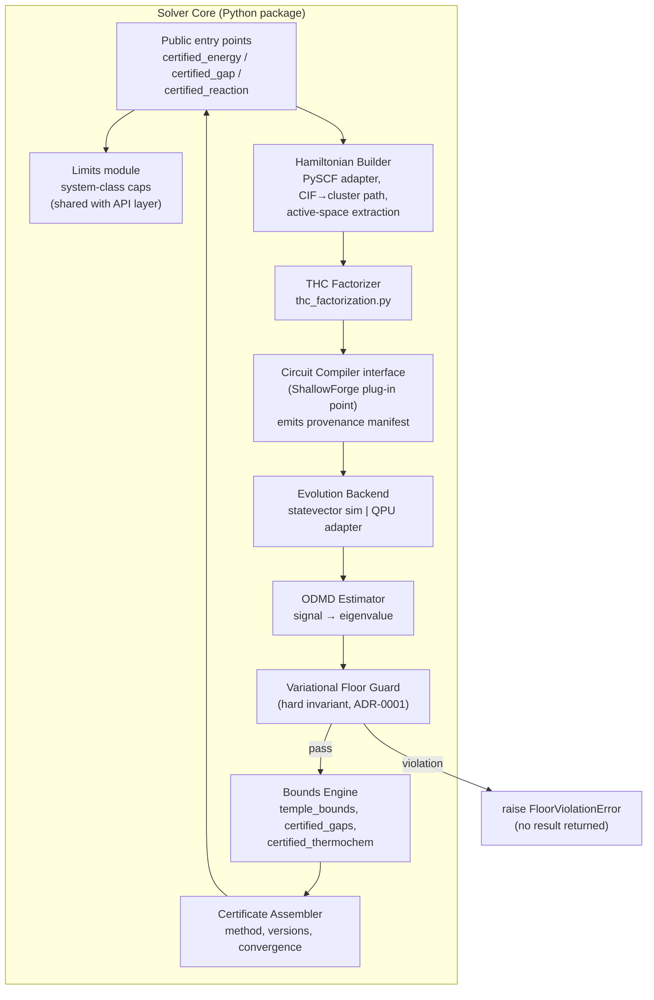

# C4 Level 3 — Components: Solver Core library

Component rules
- Floor Guard sits *between* estimation and bounds: nothing downstream ever sees a
  floor-violating estimate.
- Compiler interface is a plug-in boundary: baseline Trotter compilation ships in-core;
  ShallowForge replaces it without touching estimator code. Its manifest travels with
  the circuit into the Certificate (and into ChemCheck audits, ADR-0006/0007).
- Nb3X8 modules (strain/magnetometry/susceptibility) are thin drivers over these same
  components plus geometry sweeps — they add no new estimation logic.
