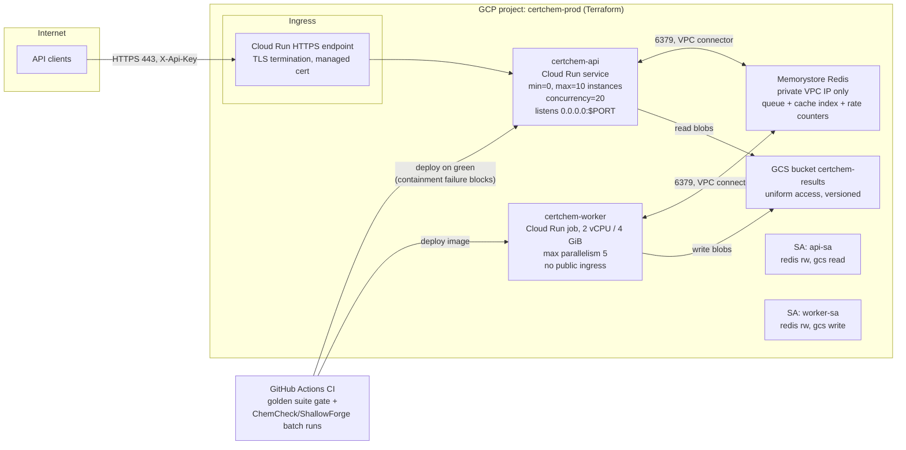

# Deployment Topology

Only CertChem is a hosted service. ChemCheck, ShallowForge, and SenseForge are
batch/CLI workloads that run locally or in CI and publish artifacts — they need
no ingress at all, which is itself a security decision.

## Traffic and trust rules
| Path | Allowed | Denied |
|---|---|---|
| Internet → api | HTTPS only, valid API key, per-key rate limit | HTTP, anonymous (except GET /v1/limits) |
| Internet → worker / redis / gcs | — | everything (no public surface) |
| worker egress | Redis + GCS via VPC | general internet (chemistry needs no egress) |
| api → worker | none directly | direct RPC (all coordination via Redis) |

## Scaling and failure behavior
- api scales to zero when idle (ADR-0009); cold start accepted (success criterion
  is 60 s end-to-end, not milliseconds).
- Long jobs go through the queue; Cloud Run request timeouts therefore never
  truncate a computation — a timeout kills at most a poll.
- Redis loss = queue/cache loss only: results in GCS survive, cache repopulates
  by recomputation (determinism, ADR-0008). Nothing irreplaceable lives in Redis.
- Deploy gate: CI runs the golden regression suite; one bracket-containment
  failure blocks the deploy (CertChem spec §7.1).
